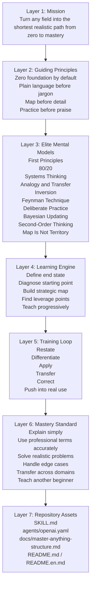

[](./README.en.md)
[](./README.md)

# Master Anything

Master Anything is a universal mastery engine for Codex/OpenClaw. It is built to take a user from zero foundation to real expertise in any field through plain-language teaching, strategic learning maps, elite mental models, deliberate practice, feedback loops, and transfer-oriented coaching.

It is not a generic learning assistant. Its purpose is to compress any unfamiliar domain into the shortest realistic path from beginner to mastery, then keep pushing until the user can apply, judge, transfer, and teach what they learned.

## Why It Exists

Most people do not fail because information is missing. They fail because:

- they do not know what to learn first
- they get overwhelmed by jargon too early
- they collect fragments instead of building structure
- they mistake recognition for mastery
- they practice too little or practice the wrong things
- they stay at the beginner layer for too long

Master Anything is designed to solve exactly those problems.

## What Makes It Different

- Zero-first by default
- Plain language before terminology
- Map before detail
- Mental models as the teaching engine
- Practice and correction as core mechanics
- Mastery as the bar: explain, apply, judge, transfer, and teach

## Vertical Architecture

The skill is intentionally layered from top to bottom so the user always moves from orientation to mastery.



See the deeper breakdown in [docs/master-anything-structure.md](docs/master-anything-structure.md).

## Elite Mental Models

These models are the backbone of the skill.

### 1. First Principles

Ask what something fundamentally is, why it exists, and what problem it solves.

### 2. 80/20

Find the small set of concepts or moves that drives most practical progress.

### 3. Systems Thinking

Show how parts connect and how variables influence one another.

### 4. Analogy and Transfer

Bridge the unknown to something the user already understands.

### 5. Inversion

Show how beginners usually fail, get confused, or waste time.

### 6. Feynman Technique

Require the user to explain the idea back in their own words.

### 7. Deliberate Practice

Target weakness directly instead of repeating what feels easy.

### 8. Bayesian Updating

Revise the learning map as new evidence appears.

### 9. Second-Order Thinking

Optimize the whole mastery path, not just the next explanation.

### 10. The Map Is Not the Territory

Keep returning from theory to real cases and real use.

## Zero-to-Mastery Workflow

1. Define the end state.
2. Diagnose the user's starting point.
3. Build a plain-language strategic map.
4. Identify the highest-leverage concepts and skills.
5. Teach progressively from intuition to formal structure.
6. Run practice loops with feedback.
7. Push into real applications and decisions.
8. Scan for weak spots and false understanding.
9. Train expert judgment.
10. Confirm mastery through explanation, application, transfer, and teaching.

## Teaching Protocol

Each important concept is taught in a fixed order:

1. Human version
2. Intuition or analogy
3. Professional version
4. Example
5. Counterexample or common confusion
6. Real use case
7. Check
8. Correction

## Mastery Standard

The user is only close to mastery when they can do most of the following:

- explain the concept in plain language
- use the correct professional terminology
- apply it to realistic cases
- distinguish it from nearby concepts
- handle common edge cases
- transfer it to related domains
- teach it clearly to another beginner

## Repository Structure

```text
master-anything/
├── SKILL.md
├── README.md
├── README.en.md
├── LICENSE
├── agents/
│   └── openai.yaml
└── docs/
    └── master-anything-structure.md
```

## Install

Copy this folder into `~/.codex/skills/` or another compatible skills directory.

## Usage

```text
Use $master-anything to teach me reinforcement learning from zero to mastery.
Start with a strategic map in plain language, then train me through practice and feedback until I can apply and explain it clearly.
```

## License

MIT
