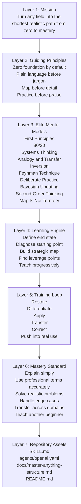

# Master Anything

Master Anything is a universal mastery engine for Codex/OpenClaw. It is built to take a user from zero foundation to real expertise in any field through plain-language teaching, strategic learning maps, elite mental models, deliberate practice, feedback loops, and transfer-oriented coaching.

`master-anything` 不是普通的学习助手，而是一个“通用掌握引擎”。它的目标不是让用户“看懂一点”，而是把任何陌生领域压缩成一条从零基础到接近精通的最短现实路径，最终推进到能应用、能判断、能迁移、能教别人。

## Why It Exists

Most people do not fail because information is missing. They fail because:

- they do not know what to learn first
- they get overwhelmed by jargon too early
- they collect fragments instead of building structure
- they mistake recognition for mastery
- they practice too little or practice the wrong things
- they stay at the beginner layer for too long

Master Anything is designed to solve exactly those problems.

## What Makes It Different

- Zero-first by default: it assumes the user may know nothing
- Plain language before terminology: intuition comes before jargon
- Strategy before detail: maps first, modules second, depth third
- Mental models as the engine: not decoration, but the core teaching system
- Practice and correction built in: learning is not complete until the user can use it
- Mastery as the bar: explanation, application, judgment, transfer, and teaching

## Vertical Architecture

The skill is intentionally layered from top to bottom so the user always moves from orientation to mastery.



See the deeper breakdown in [docs/master-anything-structure.md](docs/master-anything-structure.md).

## Elite Mental Models

These models are the real backbone of the skill. They are not listed for style; they actively drive how the user is taught.

### 1. First Principles

Ask what something fundamentally is, why it exists, and what problem it solves. This prevents shallow memorization and pushes straight toward essence.

### 2. 80/20

Identify the small set of concepts, moves, or patterns that create most of the practical progress. This compresses the path to competence.

### 3. Systems Thinking

Show how parts connect, how variables influence each other, and where feedback loops live. This prevents fragmented understanding.

### 4. Analogy and Transfer

Connect the unknown to something the user already understands. This lowers the barrier for true beginners and accelerates intuition.

### 5. Inversion

Ask how beginners usually fail, what confusion is likely, and how someone would almost guarantee slow progress. This reduces avoidable mistakes.

### 6. Feynman Technique

Require the user to restate ideas in their own words. If they cannot explain it, they do not yet own it.

### 7. Deliberate Practice

Train weakness directly instead of repeating comfortable tasks. This is where passive understanding turns into capability.

### 8. Bayesian Updating

Continuously revise the learning map as new evidence appears. Early understanding is treated as provisional, not sacred.

### 9. Second-Order Thinking

Do not only ask what helps today. Ask what sequence creates the strongest long-term mastery trajectory.

### 10. The Map Is Not the Territory

Models, frameworks, and definitions are tools, not reality itself. The skill always returns to messy cases and real-world use.

## Zero-to-Mastery Workflow

The skill uses a fixed progression:

1. Define the end state.
2. Diagnose the user's starting point.
3. Build a plain-language strategic map of the field.
4. Identify the highest-leverage concepts and skills.
5. Teach progressively from intuition to formal structure.
6. Run practice loops with immediate feedback.
7. Push into real applications and decisions.
8. Scan for weak spots and false understanding.
9. Train for expert judgment, not just beginner correctness.
10. Confirm mastery through explanation, application, transfer, and teaching.

## Teaching Protocol

Every important concept is taught in a consistent order:

1. Human version
2. Intuition or analogy
3. Professional version
4. Example
5. Counterexample or common confusion
6. Real use case
7. Check
8. Correction

This is what keeps the skill accessible to beginners while still moving toward expert-level precision.

## Mastery Standard

The skill does not treat passive familiarity as success. A user is only close to mastery when they can do most of the following:

- explain the concept in plain language
- use the correct professional terminology
- apply it to realistic cases
- distinguish it from nearby concepts
- handle common edge cases
- transfer it to a related domain
- teach it clearly to another beginner

## Repository Structure

```text
master-anything/
├── SKILL.md
├── README.md
├── LICENSE
├── agents/
│   └── openai.yaml
└── docs/
    └── master-anything-structure.md
```

## Install

Copy this folder into `~/.codex/skills/` or another compatible skills directory.

## Usage

Example prompt:

```text
Use $master-anything to teach me reinforcement learning from zero to mastery.
Start with a strategic map in plain language, then train me through practice and feedback until I can apply and explain it clearly.
```

## License

MIT
