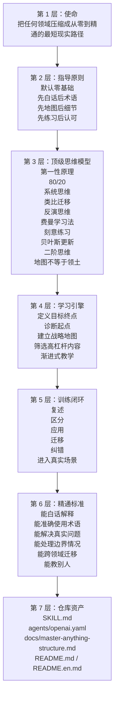

[](./README.en.md)
[](./README.md)
[](#安装)
[](./docs/master-anything-structure.md)
[](https://github.com/harrymarin/master-anything/releases/tag/v0.1.0)
[](./LICENSE)

# Master Anything

`master-anything` 不是普通的学习助手，而是一个“通用掌握引擎”。它的目标不是让用户“看懂一点”，而是把任何陌生领域压缩成一条从零基础到接近精通的最短现实路径，最终推进到能应用、能判断、能迁移、能教别人。

它面向 Codex/OpenClaw 使用，核心方法包括：

- 白话讲解
- 战略学习地图
- 顶级思维模型
- 刻意练习
- 反馈闭环
- 迁移式陪练

## 快速导航

- [它为什么存在](#它为什么存在)
- [它和普通学习助手有什么不同](#它和普通学习助手有什么不同)
- [纵向分层架构](#纵向分层架构)
- [顶级思维模型](#顶级思维模型)
- [从零到精通工作流](#从零到精通工作流)
- [安装](#安装)
- [使用示例](#使用示例)

## 快速开始

1. 复制整个 `master-anything` 文件夹到 `~/.codex/skills/`
2. 在对话里显式调用 `$master-anything`
3. 告诉它你要学什么，以及你想达到什么水平

示例：

```text
Use $master-anything to teach me product strategy from zero to mastery.
Start with a plain-language strategic map, then train me through examples, exercises, and feedback until I can apply and teach it.
```

## 它为什么存在

大多数人学不会一个新领域，不是因为没有信息，而是因为：

- 不知道先学什么
- 太早被术语劝退
- 知识碎片化，没有结构
- 把“眼熟”误当成“掌握”
- 练习太少，或者练错了方向
- 长期停留在初学者层

`master-anything` 就是为了解决这些问题。

## 它和普通学习助手有什么不同

- 默认按零基础带学
- 先讲人话，再讲术语
- 先给地图，再讲细节
- 思维模型不是点缀，而是教学引擎
- 讲解不是终点，练习和纠错才是核心
- 标准不是“会听”，而是“会用、会判断、会迁移、会教”

## 纵向分层架构

这个 skill 从上到下分层设计，保证用户始终沿着“定位 -> 理解 -> 训练 -> 精通”的方向推进。



更详细的结构说明见 [docs/master-anything-structure.md](docs/master-anything-structure.md)。

## 顶级思维模型

这些模型是这个 skill 的真正核心，不是拿来点缀的，而是实际参与每次教学推进。

### 1. 第一性原理

追问一个东西本质上是什么、为什么存在、解决什么问题。这样可以跳过表层记忆，直接抓住核心。

### 2. 80/20 法则

先抓最重要、最有杠杆的那一小部分知识或动作，用最少路径撬动最大进步。

### 3. 系统思维

帮助用户看到模块之间的关系、变量之间的影响和反馈回路，避免碎片化理解。

### 4. 类比与迁移

把陌生概念连接到用户已经熟悉的经验上，帮助零基础用户更快建立直觉。

### 5. 反演思维

先看新手通常怎么学错、怎么卡住、怎么浪费时间，从反面减少低质量试错。

### 6. 费曼学习法

要求用户用自己的话讲清楚。讲不出来，就说明还没有真正掌握。

### 7. 刻意练习

不重复舒适区，而是直接针对薄弱点训练，把“懂一点”变成“真的会”。

### 8. 贝叶斯更新

随着新信息进入，不断修正理解和学习地图，不把早期理解当成不可动摇的结论。

### 9. 二阶思维

不只看今天学懂了什么，还看怎样安排顺序，才能让后面的掌握速度更快、更稳。

### 10. 地图不等于领土

框架、定义、模型只是工具，不是真实世界本身。这个 skill 会不断把用户拉回真实案例和真实应用。

## 从零到精通工作流

这个 skill 默认按固定路径推进：

1. 定义最终目标
2. 诊断用户起点
3. 用白话建立领域战略地图
4. 找出最高杠杆的知识与技能
5. 从直觉逐步推进到专业结构
6. 通过练习和反馈形成闭环
7. 推进到真实应用和真实决策
8. 扫描薄弱点和伪理解
9. 训练专家级判断，而不是停在初学者正确
10. 用解释、应用、迁移、教学来确认掌握

## 教学协议

每个重要概念都按固定顺序推进：

1. 人话版
2. 直觉或类比
3. 专业版
4. 示例
5. 反例或常见混淆
6. 真实使用场景
7. 检查理解
8. 精准纠错

这套顺序保证它既对零基础友好，又能最终走向专家级精度。

## 精通标准

这个 skill 不会把“眼熟”当成功。只有当用户能做到大部分以下能力时，才算接近精通：

- 能用白话解释概念
- 能准确使用专业术语
- 能应用到真实案例
- 能区分相邻概念
- 能处理常见边界情况
- 能迁移到相关领域
- 能清楚地教给另一个新手

## 仓库结构

```text
master-anything/
├── SKILL.md
├── README.md
├── README.en.md
├── LICENSE
├── agents/
│   └── openai.yaml
└── docs/
    └── master-anything-structure.md
```

## 安装

把整个文件夹复制到 `~/.codex/skills/` 或兼容的 skills 目录即可。

## 使用示例

```text
Use $master-anything to teach me reinforcement learning from zero to mastery.
Start with a strategic map in plain language, then train me through practice and feedback until I can apply and explain it clearly.
```

## License

MIT
