# Master Anything Structure

This document explains the full structure of the `master-anything` skill in a form that is easier to read than a wide, flattened graph.

## Vertical Overview

```mermaid
flowchart TD
    A["1. Mission"]
    A1["Turn any field into the shortest realistic path from zero to mastery"]

    B["2. Principles"]
    B1["Zero foundation by default"]
    B2["Plain language before terminology"]
    B3["Map before detail"]
    B4["Practice before praise"]

    C["3. Mental Models"]
    C1["First Principles"]
    C2["80/20"]
    C3["Systems Thinking"]
    C4["Analogy and Transfer"]
    C5["Inversion"]
    C6["Feynman Technique"]
    C7["Deliberate Practice"]
    C8["Bayesian Updating"]
    C9["Second-Order Thinking"]
    C10["Map Is Not Territory"]

    D["4. Learning Engine"]
    D1["Define end state"]
    D2["Diagnose starting point"]
    D3["Build strategic map"]
    D4["Find leverage points"]
    D5["Teach progressively"]

    E["5. Training Loop"]
    E1["Restate"]
    E2["Differentiate"]
    E3["Apply"]
    E4["Transfer"]
    E5["Correct"]
    E6["Push into real use"]

    F["6. Mastery Standard"]
    F1["Explain simply"]
    F2["Use professional terms accurately"]
    F3["Solve realistic problems"]
    F4["Handle edge cases"]
    F5["Transfer across domains"]
    F6["Teach another beginner"]

    G["7. Repository Files"]
    G1["SKILL.md"]
    G2["agents/openai.yaml"]
    G3["README.md"]
    G4["docs/master-anything-structure.md"]

    A --> A1 --> B
    B --> B1 --> B2 --> B3 --> B4 --> C
    C --> C1 --> C2 --> C3 --> C4 --> C5 --> C6 --> C7 --> C8 --> C9 --> C10 --> D
    D --> D1 --> D2 --> D3 --> D4 --> D5 --> E
    E --> E1 --> E2 --> E3 --> E4 --> E5 --> E6 --> F
    F --> F1 --> F2 --> F3 --> F4 --> F5 --> F6 --> G
    G --> G1 --> G2 --> G3 --> G4
```



## Layer-by-Layer Explanation

### 1. Mission

The top layer defines what the skill is trying to do:

- not just explain a field
- not just summarize a topic
- but move the user from zero foundation to practical mastery as fast as realistically possible

### 2. Principles

These rules protect beginners from being overwhelmed:

- assume zero foundation first
- build intuition before terminology
- give the map before the details
- require practice before calling progress real

### 3. Mental Models

This is the compression engine of the skill. It uses:

- `First Principles` to get to essence
- `80/20` to focus on the highest-leverage pieces
- `Systems Thinking` to build structural understanding
- `Analogy and Transfer` to make new concepts intuitive
- `Inversion` to prevent common beginner mistakes
- `Feynman Technique` to expose fake understanding
- `Deliberate Practice` to attack weakness directly
- `Bayesian Updating` to revise the model as understanding improves
- `Second-Order Thinking` to optimize the whole path, not just the next step
- `Map Is Not Territory` to keep the user grounded in real use

### 4. Learning Engine

This is the standard strategic workflow:

1. define what mastery means for this field
2. diagnose where the user is starting
3. build a plain-language map of the field
4. isolate the highest-leverage concepts and actions
5. teach progressively from intuition to formal structure

### 5. Training Loop

This is where learning becomes capability:

- restate ideas in the user's own words
- differentiate nearby concepts
- apply the concept to a case
- transfer it to a related context
- correct errors precisely
- push into real use instead of toy examples

### 6. Mastery Standard

The skill only treats learning as successful when the user can:

- explain clearly
- use the right formal language
- solve realistic problems
- handle non-obvious cases
- transfer the idea to nearby domains
- teach the idea to another beginner

### 7. Repository Files

The repository mirrors the architecture:

- `SKILL.md` contains the operational logic
- `agents/openai.yaml` contains UI metadata
- `README.md` explains the value and usage
- `docs/master-anything-structure.md` explains the architecture visually

## File Layout

```text
master-anything/
├── SKILL.md
├── README.md
├── LICENSE
├── agents/
│   └── openai.yaml
└── docs/
    └── master-anything-structure.md
```
