# Master Anything Structure

This diagram describes the structure and operating flow of the `master-anything` skill.

```mermaid
flowchart TD
    A["master-anything"] --> B["Metadata Layer"]
    A --> C["Instruction Layer"]
    A --> D["Execution Layer"]
    A --> E["Output Layer"]
    A --> F["Mastery Layer"]

    B --> B1["name: master-anything"]
    B --> B2["description: zero-to-mastery learning trigger"]
    B --> B3["agents/openai.yaml"]

    C --> C1["Overview"]
    C --> C2["Core Mission"]
    C --> C3["When to Use"]
    C --> C4["Non-Negotiable Rules"]
    C --> C5["Teaching Style"]
    C --> C6["Mental Models"]

    C6 --> C61["First Principles"]
    C6 --> C62["80/20"]
    C6 --> C63["Systems Thinking"]
    C6 --> C64["Analogy and Transfer"]
    C6 --> C65["Inversion"]
    C6 --> C66["Feynman Technique"]
    C6 --> C67["Deliberate Practice"]
    C6 --> C68["Bayesian Updating"]
    C6 --> C69["Second-Order Thinking"]
    C6 --> C610["Map Is Not Territory"]

    D --> D1["Standard Workflow"]
    D1 --> D11["Define the End State"]
    D1 --> D12["Diagnose the Starting Point"]
    D1 --> D13["Build the Strategic Map"]
    D1 --> D14["Find the Leverage Points"]
    D1 --> D15["Teach Progressively"]
    D1 --> D16["Run the Training Loop"]
    D1 --> D17["Push Into Real Use"]
    D1 --> D18["Scan for Weakness"]
    D1 --> D19["Train for Expertise"]
    D1 --> D110["Confirm Mastery"]

    D --> D2["Concept Teaching Protocol"]
    D2 --> D21["Human Version"]
    D2 --> D22["Intuition"]
    D2 --> D23["Professional Version"]
    D2 --> D24["Example"]
    D2 --> D25["Counterexample or Confusion"]
    D2 --> D26["Use Case"]
    D2 --> D27["Check"]
    D2 --> D28["Correction"]

    E --> E1["Output Pattern"]
    E1 --> E11["Where you are now"]
    E1 --> E12["What we are learning now"]
    E1 --> E13["Plain-language map"]
    E1 --> E14["Professional layer"]
    E1 --> E15["Example and non-example"]
    E1 --> E16["Common mistakes"]
    E1 --> E17["Practice now"]
    E1 --> E18["Feedback and correction"]
    E1 --> E19["Next step"]

    E --> E2["Exercise Types"]
    E2 --> E21["Restate"]
    E2 --> E22["Differentiate"]
    E2 --> E23["Classify"]
    E2 --> E24["Apply"]
    E2 --> E25["Predict"]
    E2 --> E26["Compare"]
    E2 --> E27["Teach"]
    E2 --> E28["Transfer"]

    F --> F1["Zero-Beginner Protection"]
    F --> F2["Mastery Criteria"]
    F --> F3["Common Failure Modes"]
    F --> F4["Tone"]

    F2 --> F21["Explain simply"]
    F2 --> F22["Use professional terms accurately"]
    F2 --> F23["Apply to realistic cases"]
    F2 --> F24["Distinguish nearby concepts"]
    F2 --> F25["Handle edge cases"]
    F2 --> F26["Transfer to related domains"]
    F2 --> F27["Teach another beginner"]
```



## File Layout

```text
master-anything/
├── SKILL.md
├── README.md
├── LICENSE
├── agents/
│   └── openai.yaml
└── docs/
    └── master-anything-structure.md
```
